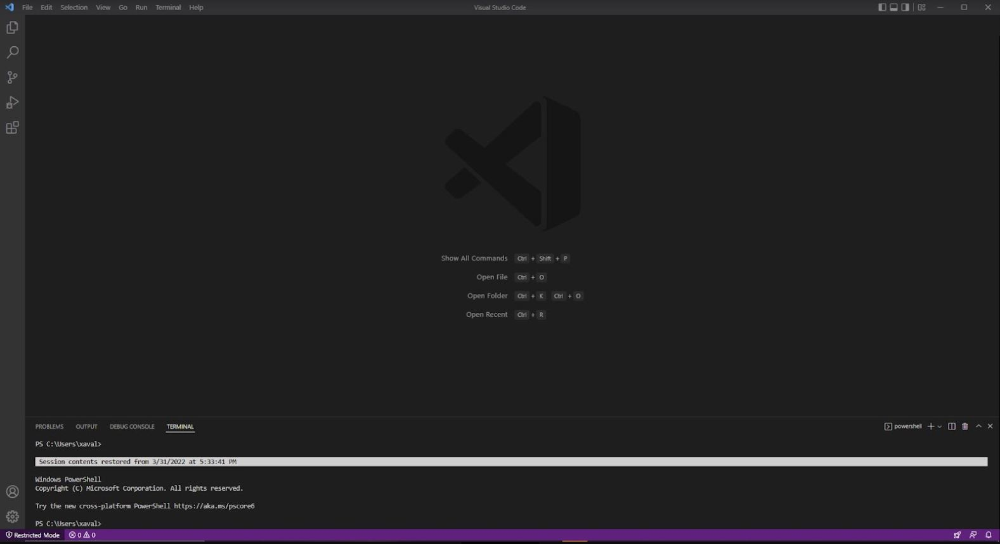
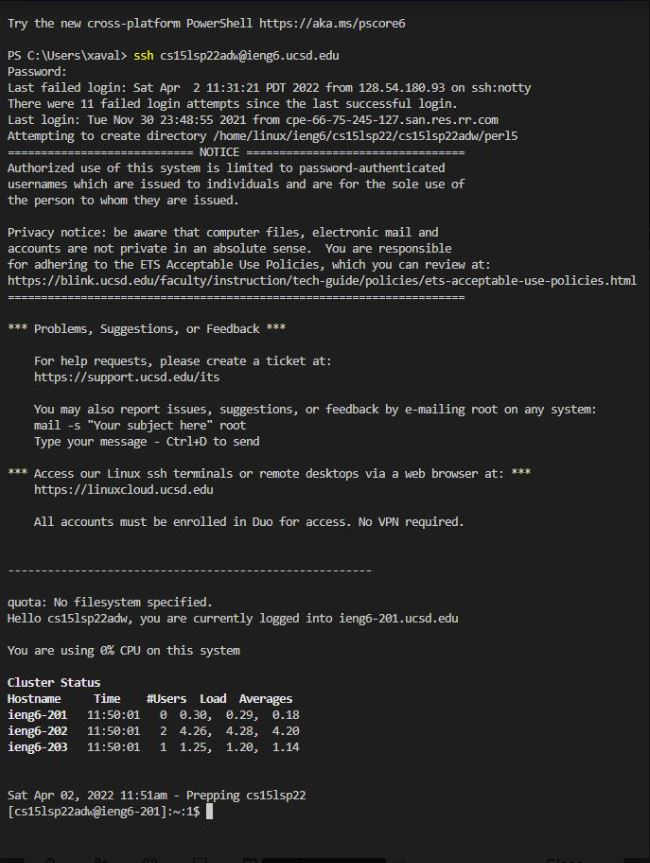
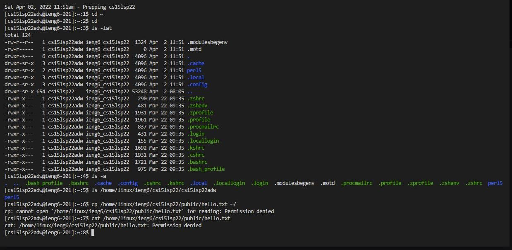
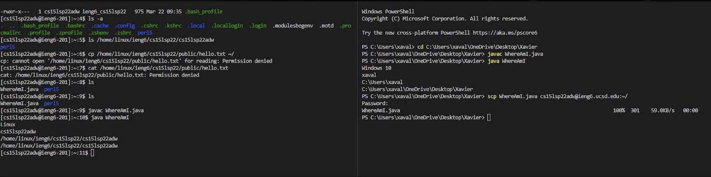
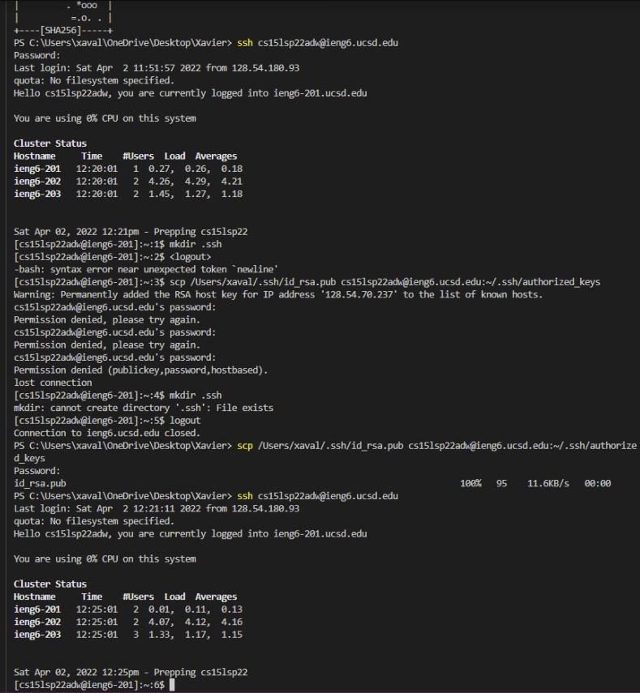
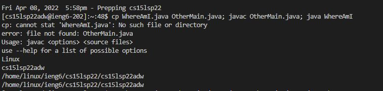

# Lab Report 1 Week 2

## By: Xavier Angeles-Cruz CSE 15L

## Installing VSCode

To download VSCode, follow this [link](https://code.visualstudio.com/). After downloadling, select the VSCode installation file from your browser and follow the installation steps. 

## Remotely Connecting

Prior to logging in, check if you have both the OpenSSH server and client installed on your device. Then, in VSCode, type in:

**$ ssh cs15lsp22zzz@ieng6.ucsd.edu** (**zzz** refers to the last characters of your username)

It will ask for your password, which will the password that you have changed for your course-specific account prior to this lab/assignment. It will ask if you want to continue connecting, type yes to continue.

## Running Some Commands

We can run some commands on the terminal:

* cd-
* cd
* ls -lat
* ls -a

These commands have different purposes, for example: the command **ls** shows files and directories, and the command **ls -a** shows hidden files and directories.

## Moving Files with **scp**

We create a file and a class called WhereAmI.java that has a main method that prints the user's OS, name, and two directories. After we compile and run WhereAmI.java, in the same terminal where we ran the file, type:

**scp WhereAmI.java cs15lsp22zzz@ieng6.ucsd.edu:~/** (**zzz** refers to the last characters of your username)

Now log in back into ieng6 server with ssh and type **ls**, it will show you the file in the home directory and you can run and compile the file on the server.

## Setting an SSH Key

To create these keys, clientside, type:

**ssh -keygen** (If on Windows: **ssh-keygen -t ed25519**)

When it asks for a passphrase, select the **enter** key (We do not want a passphrase). After you see the key's "randomart image", log in back into the ieng6 server and type:

1. **mkdir .ssh**
2. logout of server
3. (Back on client) type: **scp /Users/user/.ssh/id_rsa.pub cs15lsp22zzz@ieng6.ucsd.edu:~/.ssh/authorized_keys** (**user** refers to username of the client, **zzz** refers to the last characters of your username)

You should now be able to log into the server from the client without your password.

## Optimizing Remote Running

In this step, we are copying the file **WhereAmI.java** into the server and running it on one line. The command for this is:

**cp WhereAmI.java OtherMain.java; javac OtherMain.java; java WhereAmI**

We are running this command server-side. I had some trouble with the OtherMain.java, but the server compiled and ran WhereAmI.java.

