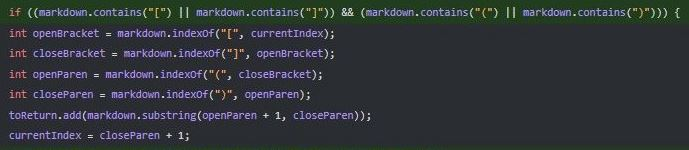
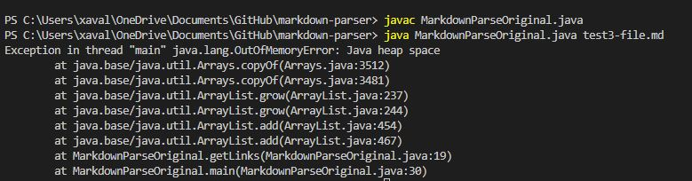
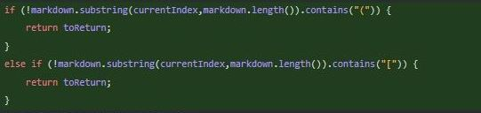
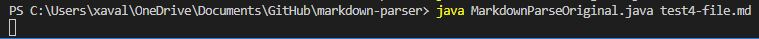
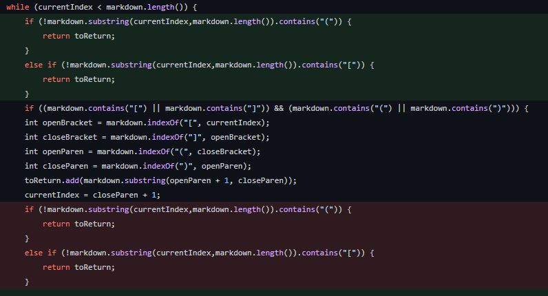
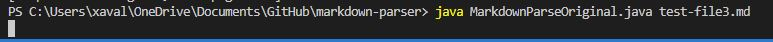

# Lab Report 2 Week 4

## By: Xavier Angeles-Cruz

There are three code changes in the screenshot. I will break up the screenshot into three parts to explain the code changes my group has made, as well as their failure-inducing inputs and symptoms.

## First Code Change

[Link to failure-inducing input file](https://github.com/XAVIERALBERT/markdown-parser/blob/main/test4-file.md) 

Symptom:

The relationship between the code change and failure-inducing input is that it remedies the problem where the link may have only brackets or parenthesises. This prevents an infinite loop by making the code find an opening bracket (or parenthesis) and a closing bracket (or parenthesis).

## Second Code Change

[Link to failure-inducing input file](https://github.com/XAVIERALBERT/markdown-parser/blob/main/test3-file.md) 

Symptom: (Infinite Loop)

This code change checks if the string doesn't have an opening bracket or parenthesis. If the string doesn't have any if those things, the program returns the ArrayList.

## Third Code Change

[Link to failure-inducing input file](https://github.com/XAVIERALBERT/markdown-parser/blob/main/test-file3.md)

Symptom: (Infinite Loop)

This code change is a change of position of the if statements from the second code change. The code change prevents an infinite loop for empty brackets or parenthesises. 