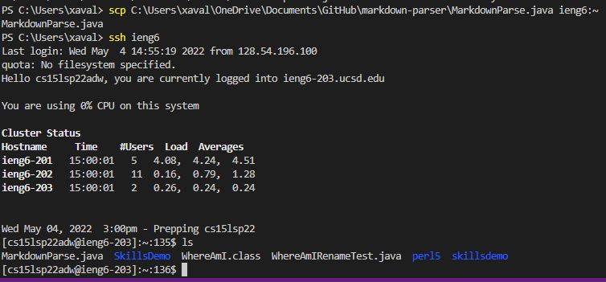
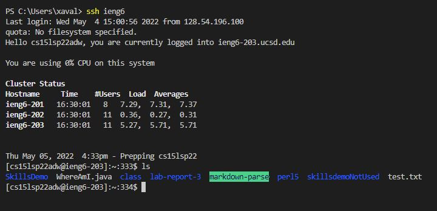

# Lab Report 3 Week 6

## By Xavier Angeles-Cruz CSE 15L

## Streamlining ssh Configuration

### .ssh/config 

### ssh Command

### scp Command

## Setup GitHub Access from ieng6

## Copying Whole Directories with scp -r

### Copying markdown-parse directory into ieng6

Screenshot of mardown-parse dir on local:

Screenshot of running scp -r part 1:

Screenshot of running scp -r part2:

Screenshot of markdown-parse dir on ieng6:

### Compiling and Running Tests
