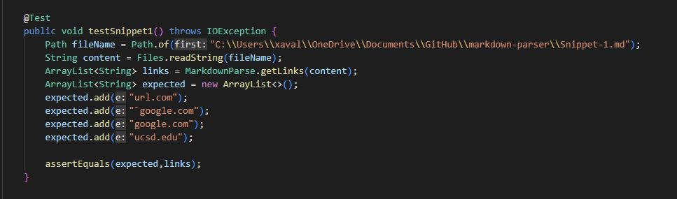
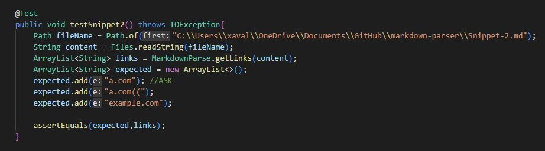
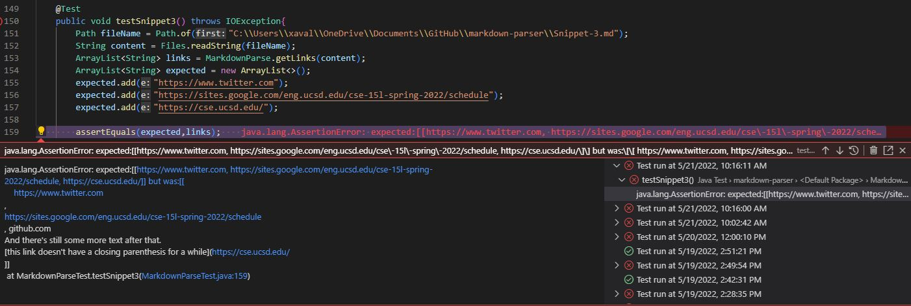
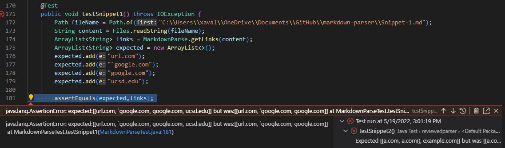
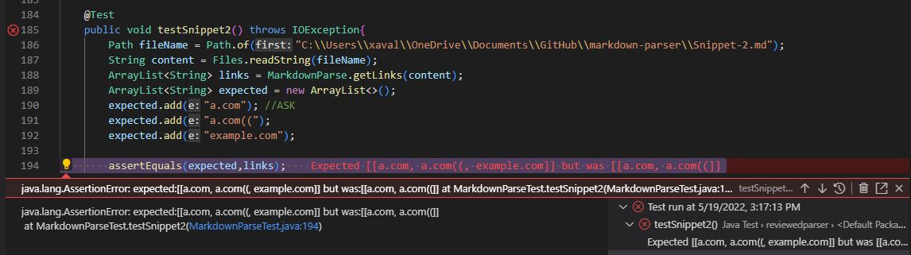
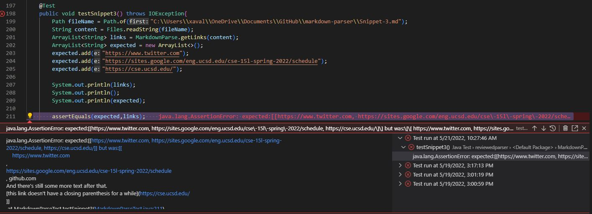

# Lab Report 4 Week 8

## By Xavier Angeles-Cruz CSE 15L

### My Implementation

#### Snippet 1

This test passed.

#### Snippet 2

This test passed.

#### Snippet 3

This test failed. This actual output of this was formatted incorrectly. Compared to the expected output array of links there is some undesired text in the actual output of links. 

### Reviewed Implementation

[Link to repository for reviewed parser](https://github.com/ohuynh21/markdown-parser)

#### Snippet 1 

This test has failed. The error included states there is a link missing from the "links" ArrayList.

#### Snippet 2

This test has failed. The error included states there is a link missing from the "links" ArrayList.

#### Snippet 3

This test has failed. The error included incorrect formatting in the actual output array and undesired text within the links itself. 

### Questions

#### Do you think there is a small (<10 lines) code change that will make your program work for snippet 1 and all related cases that use inline code with backticks? If yes, describe the code change. If not, describe why it would be a more involved change.

My program passed for Snippet 1. My code only finds the brackets and parentheses and skips other characters, even if they are in between the brackets and parentheses. It finds those brackets and parentheses and only pays attention to the elements between the brackets and parentheses.

#### Do you think there is a small (<10 lines) code change that will make your program work for snippet 2 and all related cases that nest parentheses, brackets, and escaped brackets? If yes, describe the code change. If not, describe why it would be a more involved change.

My program passed for Snippet 2. My code finds the first opening and first closing bracket and parenthesis in the file. 

#### Do you think there is a small (<10 lines) code change that will make your program work for snippet 3 and all related cases that have newlines in brackets and parentheses? If yes, describe the code change. If not, describe why it would be a more involved change.

My program failed for Snippet 3. I do not believe that a minor code change (that is less than 10 lines) can solve this and it requires a majot change. My code finds the first opening bracket and opening parenthesis and the first closing bracket and closing parenthesis to find a legal link. Since the format of Snippet 3 is very weird, the changes include formatting the array correctly and implementing code where it skips the opening bracket or parenthesis if it doesn't find a terminating bracket or parenthesis.  