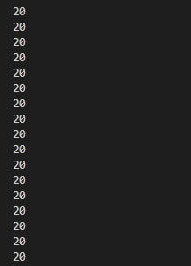
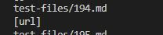
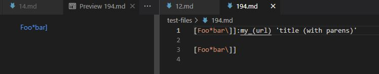
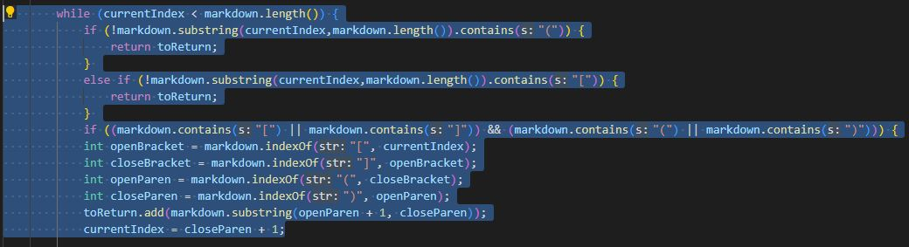
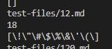
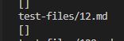
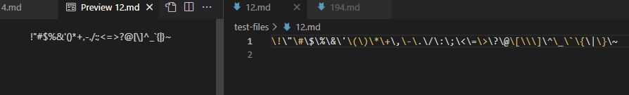

# Lab Report 5 Week 10

## By Xavier Angeles-Cruz CSE 15L

### How you found the tests with different results (Did you use vimdiff on the results of running a bash for loop? Did you search through manually? Did you use some other programmatic idea?)

For the first test, this difference was obvious, my implementation of the markdown parser was faulty at the 194.md test file in the test-files directory. There was an infinite loop error in my-markdown-parser directory. The other test was also found manually, for 12.md, and it had two different outputs for both implementations.

### Provide a link to the test-file with different-results (in the provided repository or your repository , either is fine)

[194.md test file](https://github.com/nidhidhamnani/markdown-parser/blob/main/test-files/194.md)

[12.md test file](https://github.com/nidhidhamnani/markdown-parser/blob/main/test-files/12.md)

### Test File 194.md

For this test, my implementation of markdown parser (my-markdown-parser) is incorrect. There is an infinite loop error at test file 194.md. The lab implementation returned a list of only one element in it.

### my-markdown-parser

### cse15lsp22-markdownparser

### expected

We can infer that the lab implementation is correct by looking at the preview for 194.md. The highlighted region indicates in the preview indicates a legal link, so the expected value should only have one link in the list: url. 

The fix for my implemention isn't a small one, there needs to be a major rework on the code. I do not have a fix for the program, when looking over my implementation of markdown-parser, the code made sense where it would find the first opening and closing parenthesis and bracket for it to be a legal link. I couldn't pinpoint exactly when the recurring number 20 is happening (even when I tried to edit some possible lines of code through vim).

### Test File 12.md

For this test, my implementation of markdown parser (my-markdown-parser) is incorrect. My implementation returned a list of random characters, while the lab implementation returned an empty list.

### my-markdown-parser

### cse15lsp22-markdownparser

### expected

We can infer that the lab implementation is correct by looking at the preview for 12.md. There isn't a highlighted region in the preview that would indicate a legal link, so the expected value should be an empty list. 

The fix for my implementation in regards to this test is not a small fix. It would require a large rework (maybe rewriting the whole code). The reason is that my implementation of markdown parser looks for the first opening and closing parenthesis and the first opening and closing bracket for it to be considered a legal link.

 
